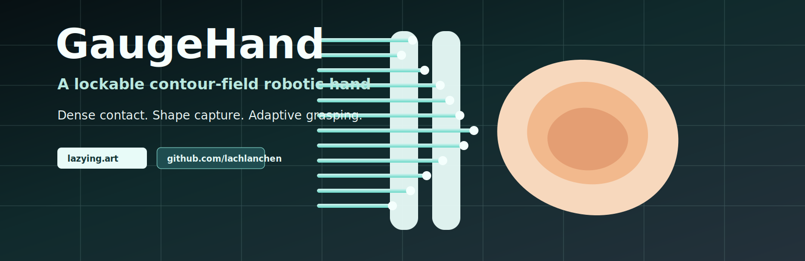
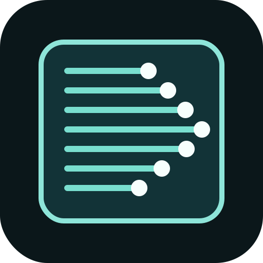

<p align="center">
  <a href="https://lazying.art">
    
  </a>
</p>

<p align="center">
  <a href="https://github.com/lachlanchen/GaugeHand"></a>
  <a href="https://lazying.art"></a>
  <a href="publications/gaugehand_contour_field_feasibility.tex"></a>
  <a href="references/contour-field-robotic-hand-report.md"></a>
</p>

<p align="center">
  <b>English</b> ·
  <a href="i18n/README.zh-Hans.md">简体中文</a> ·
  <a href="i18n/README.zh-Hant.md">繁體中文</a> ·
  <a href="i18n/README.ja.md">日本語</a> ·
  <a href="i18n/README.ko.md">한국어</a> ·
  <a href="i18n/README.es.md">Español</a> ·
  <a href="i18n/README.fr.md">Français</a> ·
  <a href="i18n/README.de.md">Deutsch</a> ·
  <a href="i18n/README.pt.md">Português</a> ·
  <a href="i18n/README.ru.md">Русский</a> ·
  <a href="i18n/README.ar.md">العربية</a>
</p>

# GaugeHand

**GaugeHand is a contour-field robotic hand concept by [Lachlan Chen](https://github.com/lachlanchen), published from the Lazying Art research stream at [lazying.art](https://lazying.art).**

The idea is simple: stop copying the human hand joint-for-joint. Instead, build a dense field of many simple contact elements, like a 3D contour gauge or pin screen, so the object itself shapes the gripper.

GaugeHand is a proposed **lockable, self-sensing, dense-contact manipulator**:

- many passive sliding pins or micro-contact elements;
- soft tips or a compliant skin for safe frictional contact;
- a shared locking layer that turns the adapted shape into a temporary fixture;
- displacement sensing that turns the gripper into a tactile depth camera;
- future shear-capable contact patches for in-hand manipulation.

## Creator Profile

<table>
  <tr>
    <td width="90">
      
    </td>
    <td>
      <b>Lachlan Chen</b><br>
      Robotics, open research notes, AI-assisted publication, and hardware idea development.<br>
      <a href="https://github.com/lachlanchen">github.com/lachlanchen</a> ·
      <a href="https://lazying.art">lazying.art</a>
    </td>
  </tr>
</table>

## Concept Illustration

<p align="center">
  
</p>

This AgInTi-generated PNG illustrates the core hardware idea: the robot keeps the LazyingArt identity and notebook reference, while its conventional hands are replaced by dense contour-gauge pin-array grippers that conform around the notebook edges.

## Why It Matters

Most dexterous hands spend complexity on anthropomorphic joints. GaugeHand spends complexity on contact. That changes the engineering question from:

> How do we reproduce the human hand?

to:

> How do we make many simple contacts cooperate as a useful hand?

This may be better for unknown-object pickup, fragile-object handling, geometry capture, packaging, food, laboratory automation, recycling, and low-cost robotics.

## Core Thesis

Passive contour capture is not enough. A contour gauge can copy shape, but it cannot manipulate by itself. The publishable GaugeHand thesis is the integration:

| Capability | Why it matters |
| --- | --- |
| Dense contact field | More local support than sparse fingers |
| Lockable morphology | Turns passive adaptation into a stable grasp |
| Shape/tactile sensing | Pin displacement becomes object geometry |
| Robotic closure | Makes the contour field useful as an end effector |
| Shear upgrade path | Enables later rotation, translation, and regrasping |

## First MVP

Do not start with a five-finger hand. Build a two-sided lockable pin-array gripper:

1. Two small contour-gauge pads face each other.
2. Each pad has passive spring-return pins.
3. Each pin has a soft silicone tip or a replaceable skin.
4. A shared lock plate freezes the adapted contour.
5. A simple linear actuator or parallel gripper provides closure.
6. Optional first sensors measure pin displacement.

The MVP should beat a parallel gripper on irregular objects and beat a soft gripper on contact-shape observability.

## Repository Map

| Path | Description |
| --- | --- |
| [references/contour-field-robotic-hand-report.md](references/contour-field-robotic-hand-report.md) | Main deep research report |
| [publications/gaugehand_contour_field_feasibility.tex](publications/gaugehand_contour_field_feasibility.tex) | Detailed LaTeX feasibility paper |
| [publications/gaugehand_references.bib](publications/gaugehand_references.bib) | Bibliography for the paper |
| [references/commercial-products-and-baselines.md](references/commercial-products-and-baselines.md) | Commercial products and benchmark grippers |
| [references/chinese-market-procurement-notes.md](references/chinese-market-procurement-notes.md) | Taobao/Chinese-market search and procurement notes |
| [references/ideas-codex-handoff.md](references/ideas-codex-handoff.md) | Handoff prompt for publishing into the IDEAS repo |
| [skills/publish-repo/SKILL.md](skills/publish-repo/SKILL.md) | Portable Codex/AgInTi skill for GitHub publishing |
| [assets/banner.svg](assets/banner.svg) | README banner |
| [assets/logo.svg](assets/logo.svg) | Project logo |
| [assets/gaugehand-robot-notebook.png](assets/gaugehand-robot-notebook.png) | AgInTi concept illustration |

## Baselines To Compare

GaugeHand should be evaluated against adjacent products, not only against other research prototypes.

| Baseline | What it tests |
| --- | --- |
| Parallel electric gripper | Minimal industrial pickup baseline |
| Soft gripper | Adaptive enveloping without shape readout |
| Three-finger adaptive gripper | Sparse multi-contact grasping |
| qb SoftHand | Underactuated anthropomorphic synergy |
| Allegro / Shadow / OmniHand-style hands | High-DOF dexterous hand route |
| Contour gauge / pin screen | Passive shape sampling mechanism |
| Meshed pin-array gripper | Closest academic pin-array grasping reference |

## Research Questions

- How dense should the pin field be before force capacity becomes too low?
- Can a single shared lock provide uniform holding force across many pins?
- What soft-tip material gives enough friction without damaging objects?
- How much shape information is useful for grasp stability prediction?
- Can shear be added through tilting pins, moving skins, or patch-level lateral actuation?
- Which markets value shape-aware grasping enough to justify the mechanism?

## Roadmap

| Stage | Goal | Output |
| --- | --- | --- |
| 0 | Mechanism teardown | Compare contour gauges, pin screens, and soft grippers |
| 1 | Passive lockable pad | One pin-array pad with spring return and lock |
| 2 | Two-sided gripper | Pick up irregular objects with opposing pin arrays |
| 3 | Sensing | Add displacement maps and slip detection |
| 4 | Shear layer | Add lateral contact control for simple in-hand motion |
| 5 | Product focus | Narrow to one market: labware, food, packaging, recycling, or tools |

## Publish Into IDEAS

This repo includes a handoff note for publishing the idea into the neighboring IDEAS repository:

[references/ideas-codex-handoff.md](references/ideas-codex-handoff.md)

That note tells an IDEAS Codex session how to create:

- `ideas/gaugehand-contour-field-robotic-hand.md`
- `publications/gaugehand-contour-field-robotic-hand/gaugehand-contour-field-robotic-hand.tex`
- `publications/gaugehand-contour-field-robotic-hand/gaugehand-contour-field-robotic-hand.pdf`

## Publish Repo Skill

The reusable skill in [skills/publish-repo](skills/publish-repo) helps Codex or AgInTi publish a local git repo to GitHub safely:

- checks `gh` authentication;
- refuses to publish dirty worktrees unless the agent commits first;
- creates or connects the GitHub repository;
- pushes the current branch;
- sets homepage, description, and topics;
- keeps repository-specific instructions in `SKILL.md`.

## Support

<table>
  <tr>
    <td width="70%">
      <b>Support open research notes like GaugeHand.</b><br>
      This repository is part of Lachlan Chen's public idea notebook. Donations help keep exploratory hardware, robotics, and publication work moving.
    </td>
    <td align="center">
      <a href="https://github.com/sponsors/lachlanchen"></a><br>
      <a href="https://lazying.art"></a>
    </td>
  </tr>
</table>

## Citation Starter

```bibtex
@misc{chen2026gaugehand,
  title = {GaugeHand: A Lockable Contour-Field Robotic Hand for Dense-Contact Grasping},
  author = {Chen, Lachlan},
  year = {2026},
  url = {https://github.com/lachlanchen/GaugeHand}
}
```

## License

No license has been selected yet. Until a license is added, all rights are reserved by the repository owner.
